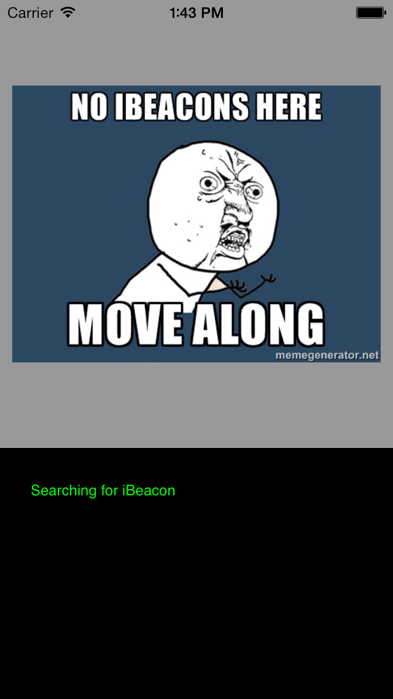

# iBeacon PoC

Small project to get my RedBearLabs Beacon B1 running as the sample code provided with the beacon doesn't run [www.redbear.net](http://www.redbear.net/support.html).
Loosely based on a tutorial at [www.devfright.com/ibeacons-tutorial-ios-7-clbeaconregion-clbeacon/](http://www.devfright.com/ibeacons-tutorial-ios-7-clbeaconregion-clbeacon/).

## Get started:
Download a free app like  [Locate IB](https://itunes.apple.com/us/app/locate-for-ibeacon/id738709014?mt=8) if you don't know your Beacons UUID, mine just came in a small box with nothing but the beacon. I still don't know what the button on it does - probably related to firmware updating?
...And grab the UUID from the app and enter it into the RGViewController.m
where it says "Add your beacon UUID here".

As the code requires an enterRegion event to happen before starting to read data from the beacon I found it easiest to turn off the beacon, then run the app, and then turn on the beacon. To the CLLocationManager this looks exactly as someone walking within range of the beacon.

It is important to mention that this will, of course, only work if you run it on the actual device and not in the simulator.

MIT licence.

